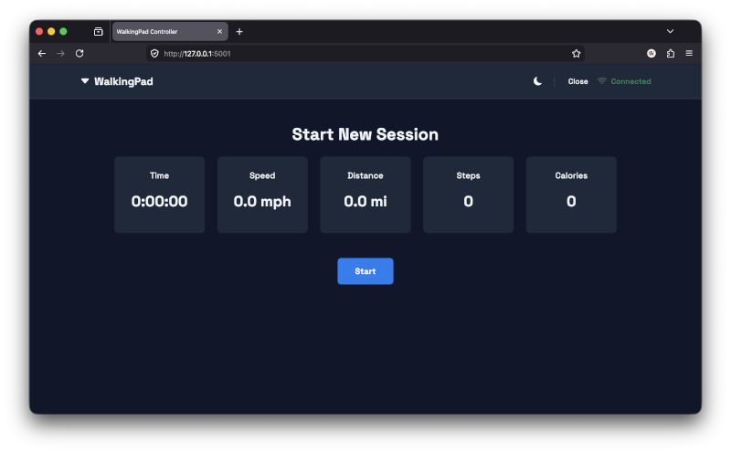
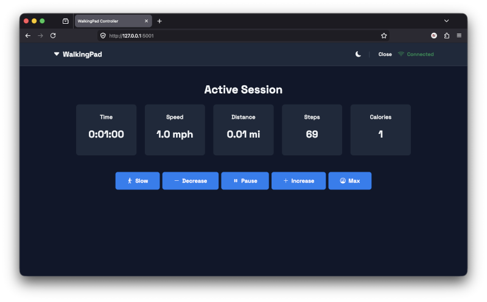
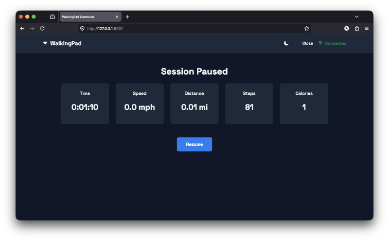

# WalkingPad Web Controller

A web-based application to control your KingSmith WalkingPad treadmill via Bluetooth Low Energy (BLE), offering features and a user experience that aims to improve upon the official app and remote.

This project was born out of a desire for a more flexible WalkingPad experience, specifically to address the limitations of the official controls, such as the inability to truly pause and resume a session (especially after stepping off) and the lack of cumulative session stat tracking across these pauses. With this application, you can easily hop off your WalkingPad, or pause it via the app/remote, and then seamlessly continue your session, tracking your total progress.

This application was built for personal use but can be easily adapted for your own needs (e.g., metric instead of imperial measurements).

## Key Features

* **Web-Based Interface:** Control your WalkingPad from any device on your local network using a web browser.
* **Bluetooth LE Connection:** Directly connects to and controls your WalkingPad via the `bleak` and `ph4-walkingpad` libraries.
* **Automatic Device Discovery:** Scans for your WalkingPad by device name or cached MAC address, with 3-retry exponential backoff for transient connection issues.
* **Full Session Control:**
    * Start new walking sessions.
    * Pause sessions via the app.
    * Resume sessions at the last used speed (uses a speed history buffer of 15 samples).
* **Intelligent Auto-Pause & Resume:**
    * Automatically detects if you've stepped off the WalkingPad or if it was stopped via the physical remote, then transitions to a paused state.
    * On auto-pause, uses the *oldest* recorded speed from history (skipping the deceleration phase) for stable resume speeds.
    * On manual pause, uses the *most recent* speed from history.
    * 7-second grace period after resume to prevent immediate re-auto-pause during belt spin-up.
* **Dynamic Stat Tracking:** Displays and updates live session data (polled every 1.5 seconds):
    * Current Speed (mph)
    * Cumulative Distance (miles)
    * Cumulative Steps
    * Estimated Calories Burned (~95 kcal/mile)
    * Cumulative Active Time (H:MM:SS format)
* **Precise Speed Adjustments:**
    * Increase/Decrease speed buttons (0.6 km/h steps, configurable).
    * "Max Speed" preset button (default: 6.0 km/h / ~3.7 mph, configurable).
    * "Slow Walk" preset button (default: 4.5 km/h / ~2.8 mph, configurable).
* **Dark Mode:** Three-state theme toggle (Light → Dark → System) with localStorage persistence and automatic OS preference following.
* **User-Friendly Conveniences:**
    * Application automatically opens in your default web browser on startup.
    * Includes a batch script (`start_app.bat`) for easy launching via a desktop/taskbar shortcut on Windows.
    * Clean, modern responsive UI built with Bootstrap 5.3 and Bootstrap Icons.
    * Connection status indicator always visible in the header (Connected / Connecting / Disconnected).
    * "Close" button in the app to cleanly shut down the server.
* **Cross-Platform:** Runs on Windows, macOS, and Linux systems that have Python and a Bluetooth adapter. Includes fixes for macOS CoreBluetooth reliability issues.

## Screenshots

Below are some representative screenshots of the application in action:

### Start Session Screen
This is the initial screen you see after connecting to the WalkingPad, before a session has begun.


### Active Session Screen
Displays live stats while you are actively walking. Includes controls for speed and pausing.


### Paused Session Screen
Shown when a session is paused, either manually or automatically. Displays cumulative stats and allows you to resume.


## Supported Models

This application is known to work with the **WalkingPad C2** model (Bluetooth device name: `KS-BLC2`).

It *should* also work with other WalkingPad models supported by the underlying `ph4-walkingpad` Python library, such as A1 and R1 PRO. Compatibility may vary depending on the specific model and firmware. If your device has a different Bluetooth name, see the [Configuration](#configuration) section below.

## Credit & Core Dependency

This application relies heavily on the excellent **`ph4-walkingpad`** Python library created by **ph4x** for Bluetooth communication and control of the WalkingPad. This project would not be possible without their work in reverse-engineering the protocol and providing the control interface.

* **ph4-walkingpad on PyPI:** <https://pypi.org/project/ph4-walkingpad/>

## Prerequisites

* Python 3.8 or newer.
* A Bluetooth adapter on the computer running this application.
* A compatible WalkingPad treadmill.
* The `pip` package installer for Python.

## Setup and Installation

1.  **Clone the Repository (or download files):**
    ```bash
    # If you have git installed:
    # git clone <your-repository-url>
    # cd <repository-name>
    # Otherwise, download the files and navigate to the directory.
    ```

2.  **Create a Python Virtual Environment:**
    (Recommended to keep dependencies isolated)
    Open a terminal or command prompt in the project directory:
    ```bash
    python -m venv venv
    ```

3.  **Activate the Virtual Environment:**
    * On Windows:
        ```cmd
        venv\Scripts\activate
        ```
    * On macOS/Linux:
        ```bash
        source venv/bin/activate
        ```
    You should see `(venv)` at the beginning of your command prompt.

4.  **Install Dependencies:**
    With the virtual environment activated, install the required Python packages:
    ```bash
    pip install -r requirements.txt
    ```
    This installs: `flask`, `bleak`, `ph4-walkingpad`, `waitress`.

## Running the Application

This application uses the `waitress` WSGI server for a more stable experience than Flask's built-in development server. It listens on port **5001** by default.

1.  Ensure your WalkingPad is powered on and discoverable via Bluetooth.
2.  Make sure your virtual environment is activated.
3.  Run the application using the provided `run.py` script:
    ```bash
    python run.py
    ```
4.  The script will start the Waitress server and automatically open the application in your default web browser at `http://127.0.0.1:5001`.
5.  The console window running `run.py` will display timestamped logs from the application. You can stop the server by pressing `Ctrl+C` in this window, or by using the "Close" button in the web application's header.

**For easy launching on Windows:**
A `start_app.bat` script is provided to automate virtual environment activation and running `run.py`. You can create a desktop shortcut pointing to this `.bat` file and configure the shortcut to run minimized.

## How to Use

1.  **Connection:**
    * When the app starts, it will attempt to scan for and connect to your WalkingPad (device name `KS-BLC2` by default).
    * The header displays the connection status: "Connecting..." → "Connected" or "Disconnected".
    * Connection attempts include automatic retry logic (up to 3 attempts with exponential backoff).
    * If disconnected, a "Connect" or "Try Again" button will be available.
    * Once connected, the device's MAC address is cached for faster reconnection on subsequent runs.

2.  **Starting a Session:**
    * Once connected, if no session is active, you'll see the "Start New Session" screen.
    * Stat cards show initial values (0 distance, 0 steps, 0:00:00 time, etc.).
    * Click the "Start" button to begin your workout.

3.  **Active Session:**
    * The "Active Session" screen will appear with live-updating stats.
    * Control buttons are available:
        * **Slow:** Sets speed to the predefined slow walk (~2.8 mph / 4.5 km/h).
        * **Decrease:** Lowers speed by one step (0.6 km/h).
        * **Pause:** Pauses the session and stops the belt.
        * **Increase:** Raises speed by one step (0.6 km/h).
        * **Max:** Sets speed to the maximum configured (~3.7 mph / 6.0 km/h).
    * If you step off the pad or stop it via the physical remote, the app detects this and automatically switches to the "Paused Session" screen.

4.  **Paused Session:**
    * The "Paused Session" screen shows your current cumulative stats.
    * A "Resume" button is available to continue your session at the speed you were using before pausing.

5.  **Theme Toggle:**
    * Click the moon/sun icon in the header to cycle through: Light → Dark → System (follows OS preference).

6.  **Ending the Application:**
    * Click the "Close" button in the header of the web interface. This will shut down the Python server process.

## Configuration

All configurable settings are at the top of `app.py`:

### Speed Settings (in km/h)
| Constant | Default | Description |
|---|---|---|
| `MAX_SPEED_KMH` | `6.0` (~3.7 mph) | Maximum speed for the "Max" button |
| `MIN_SPEED_KMH` | `1.0` | Minimum speed floor |
| `SPEED_STEP` | `0.6` | Speed change per Increase/Decrease press |
| `SLOW_WALK_SPEED_KMH` | `4.5` (~2.8 mph) | Target speed for the "Slow" button |

### Device Name
If your WalkingPad broadcasts a different Bluetooth name, change:
```python
BLE_DEVICE_NAME = "KS-BLC2"  # Change to match your device's Bluetooth name
```

### Server Port
Edit `run.py` to change the default port:
```python
PORT = 5001  # Change as needed
```

### Calibration Constants
| Constant | Default | Description |
|---|---|---|
| `KCAL_PER_MILE` | `95` | Rough calories burned per mile for estimate |

## Architecture

* **Web Server:** Flask with Waitress WSGI server (production-grade, replaces Flask dev server).
* **BLE Communication:** Runs in a dedicated background daemon thread with its own asyncio event loop, using `bleak` for BLE and `ph4-walkingpad` for device protocol.
* **Frontend:** Jinja2 templates with Bootstrap 5.3, Bootstrap Icons, and Google Fonts (Space Grotesk). Stats are live-polling via JavaScript `fetch()` to a `/stats` JSON endpoint.
* **State Management:** Session state and stats tracked in Python global variables; the BLE event loop is single-threaded so concurrent access is not an issue.

## Troubleshooting

* **Connection Issues:**
    * Ensure your computer's Bluetooth is turned on.
    * Make sure your WalkingPad is powered on and not connected to another device (e.g., your phone's official app).
    * Try moving the WalkingPad or your computer closer to improve signal strength.
    * Check the console window (where you ran `python run.py`) for timestamped error messages.
    * The app retries up to 3 times with exponential backoff before reporting failure.

* **Icons Not Displaying:**
    * This application uses Bootstrap Icons loaded from a CDN (`https://cdn.jsdelivr.net/npm/bootstrap-icons@1.11.3/`). Ensure the browser has an internet connection. If specific icons are missing, try updating the version number in `base.html`.

* **Dark Mode Not Working:**
    * Dark mode relies on CSS custom properties and JavaScript. Ensure browser JavaScript is enabled. Theme preference is stored in `localStorage`.

* **macOS-Specific BLE Issues:**
    * See the "Completed Features" section in [`ROADMAP.md`](ROADMAP.md) for details on cross-platform BLE reliability fixes.

* **Metrics Not Updating After Pause/Resume:**
    * The app now properly manages the stats monitor task lifecycle across pause/resume cycles. If issues persist, check console logs for `ask_stats error` or `Status poll timeout` messages.

* **General App Behavior:**
    * Review the console logs (Python/Waitress server) and the browser's developer console (F12 → Console) for errors.

## Roadmap & Changelog

See [`ROADMAP.md`](ROADMAP.md) for completed features, planned improvements, and the project roadmap.

## License

See [`LICENSE`](LICENSE) for details.
