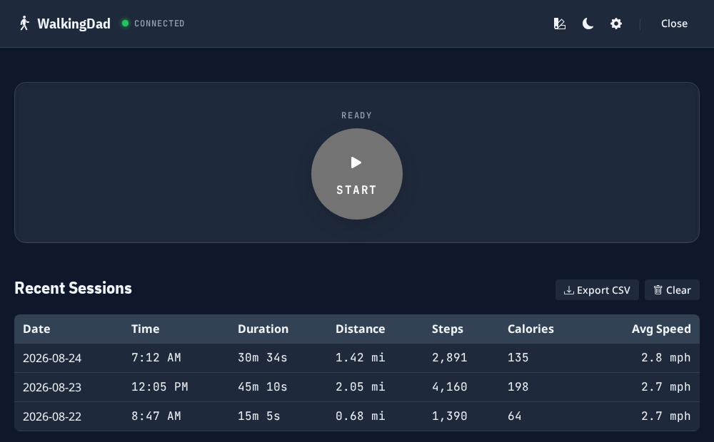
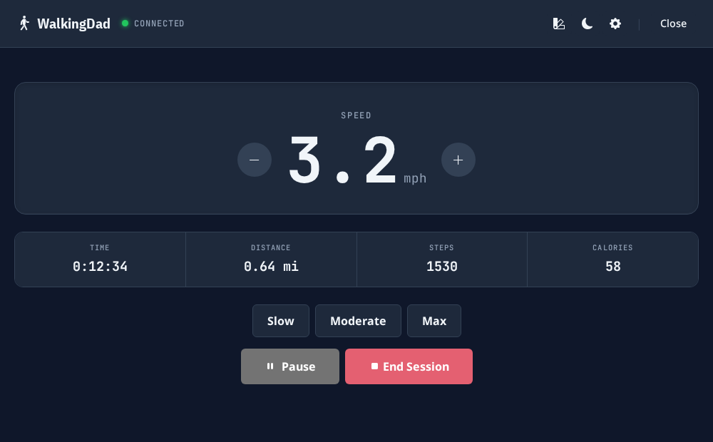
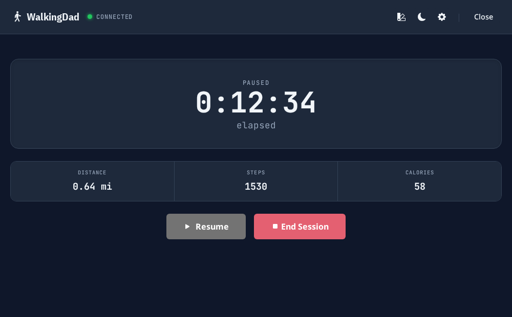

<p align="center"></p>

# WalkingDad

> Your WalkingPad's original app is trash. This isn't.

A desktop web controller for KingSmith WalkingPad treadmills. Runs locally, connects over Bluetooth, and doesn't ask you to create an account before it lets you walk. Because you shouldn't need an account to walk.

## Why

The official WalkingPad experience is a bloated mobile app that wants your email, your personal data, and probably a blood sample. WalkingDad runs on whatever machine has Python and Bluetooth, serves a clean web UI to any browser on your network, and ships with zero accounts, zero telemetry, and zero opinions about how far you should walk.

## Features

- **Web UI** — Control your treadmill from any browser on your local network
- **Real-time stats** — Speed, distance, steps, calories, and active time, updated live
- **Smart pause & resume** — Auto-detects when you step off; remembers your speed; configurable grace period prevents re-triggering on restart
- **Speed presets** — Max, slow walk, and incremental increase/decrease buttons
- **Session history** — Completed sessions saved to `session_history.json` with full stats; last 10 shown on the start screen. Includes CSV export and history clearing.
- **Crash recovery** — If the server crashes or restarts mid-session, your stats aren't lost. The start screen offers to restore the interrupted session (paused, ready to resume) or discard it.
- **Settings page** — Gear icon in the header lets you change any setting (device name, speed limits, port, and more) from the browser without editing files
- **Dark mode** — Three-state toggle (Light → Dark → System) with localStorage persistence
- **Cross-platform BLE** — Tested on Windows, macOS, and Linux with retry logic and event loop cleanup
- **Graceful shutdown** — Stops the belt, switches to standby, and disconnects BLE whether you click Close in the UI, press Ctrl+C, or kill the process. Web UI shows "Server is shutting down" notification so you know what happened. Includes an `atexit` safety net as a last resort.
- **No account. No cloud. No phone required.**

## Screenshots

**Start**


**Active**


**Paused**


## Quick Start

**Requirements:** Python 3.10+, Bluetooth adapter, compatible WalkingPad (confirmed: C2 / `KS-BLC2`).

```bash
# Clone and enter the project
git clone git@github.com:SeanathanVT/WalkingDad.git
cd WalkingDad

# Set up a virtual environment
python -m venv venv
source venv/bin/activate   # Windows: venv\Scripts\activate

# Install dependencies
pip install -r requirements.txt

# Power on your WalkingPad, then run
python run.py
```

The app opens your browser automatically at `http://127.0.0.1:5001`. A console window will stream timestamped logs — keep it open while the app runs.

**Windows shortcut:** Double-click `start_app.bat` instead of running the commands manually.

## Usage

1. Power on your WalkingPad. The app connects automatically on startup (up to 3 retries with exponential backoff).
2. Click **Start** to begin a session. Stats update in real time.
3. Adjust speed with the control buttons, or click **Pause** to stop the belt.
4. If you step off the pad, the app auto-pauses. Click **Resume** to pick back up.
5. Toggle themes or adjust settings with the icons in the header. Close the app with **Close**.

## Configuration

All settings can be changed from the **Settings page** (gear icon in the header), or by editing `config.json` directly. Copy `config.json.example` to `config.json` to get started — running without the file uses the built-in defaults shown below.

| Key | Default | Description |
|---|---|---|
| `ble_device_name` | `"KS-BLC2"` | Your treadmill's Bluetooth name |
| `max_speed_kmh` | `6.0` | Max speed button (~3.7 mph) |
| `min_speed_kmh` | `1.0` | Speed floor |
| `speed_step` | `0.6` | Increment per button press |
| `slow_walk_speed_kmh` | `4.5` | Slow Walk preset (~2.8 mph) |
| `kcal_per_mile` | `95` | Calorie estimate constant |
| `resume_grace_period_seconds` | `7` | Seconds before auto-pause can trigger after start/resume (minimum 3) |
| `history_display_limit` | `10` | Sessions shown on the start screen |
| `host` | `"0.0.0.0"` | Network interface to bind |
| `port` | `5001` | Server port |
| `waitress_threads` | `16` | Server worker thread count (4-128) |

Changes to most settings take effect immediately via the Settings page. `host`, `port`, and `waitress_threads` require restarting the app.

## Troubleshooting

- **Won't connect:** Make sure your WalkingPad is powered on and not paired to another device (like your phone). Check the console for log details.
- **Icons missing:** Bootstrap Icons load from a CDN — make sure your browser has internet access.
- **Stats stop updating:** The app detects a dead BLE connection automatically (during an active session and while paused/idle) and shows **Connection Failed — Try Again** rather than freezing silently. If stats stay stuck without that screen appearing, check the console for `ask_stats` errors and restart the app.
- **macOS BLE quirks:** See [ROADMAP.md](ROADMAP.md) Phase 1.1 for the full list of cross-platform reliability fixes.

## Credits

Forked and expanded from the original [walkingpad](https://github.com/CodeJawn/walkingpad) app by **[CodeJawn](https://github.com/CodeJawn)** — solid foundation, good on you, dude. Built on the excellent [`ph4-walkingpad`](https://pypi.org/project/ph4-walkingpad/) library by ph4x, which handles all Bluetooth protocol communication with the treadmill. None of this would work without that reverse engineering effort.

## Roadmap

See [ROADMAP.md](ROADMAP.md) for completed features and planned improvements across six phases.

## Changelog

See [CHANGELOG.md](CHANGELOG.md) for a history of changes.

## License

See [LICENSE](LICENSE).
